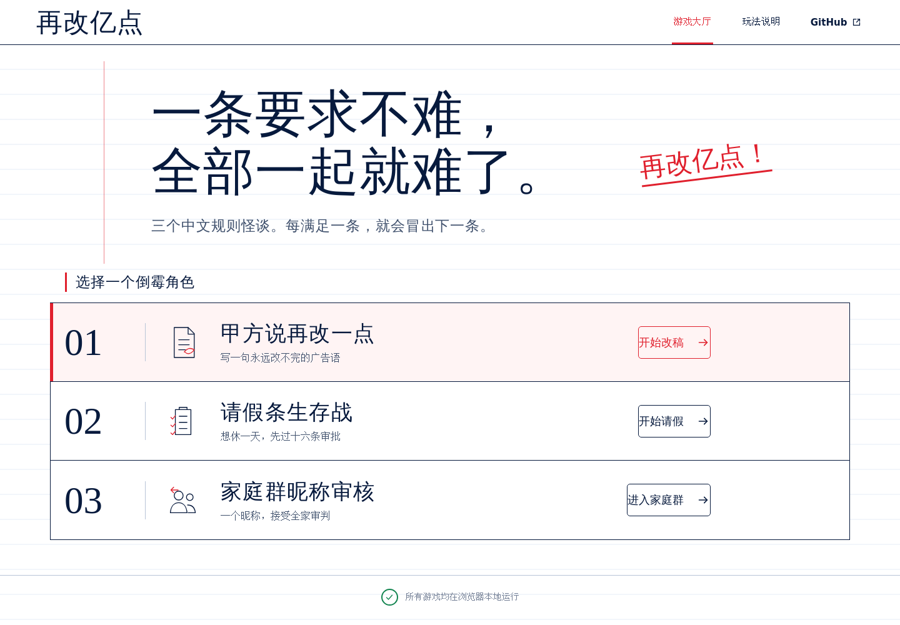
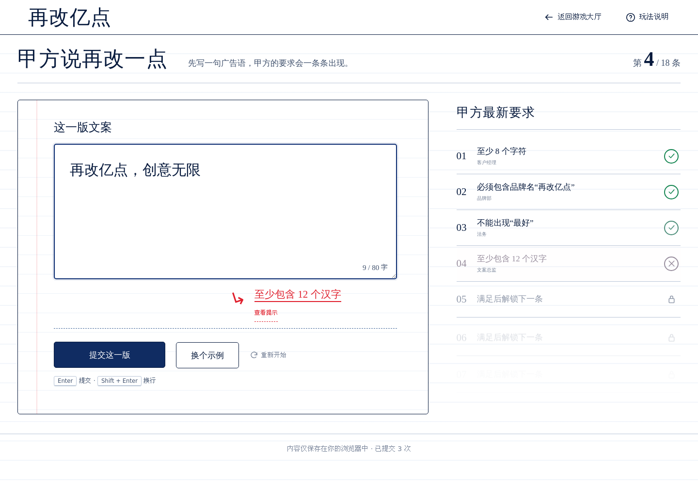

<div align="center">

# 再改亿点

**一条要求不难，全部一起就难了。**

三个中文递进规则小游戏。每满足一条，就会冒出下一条。

[在线体验](https://gamebunensi.github.io/one-more-rule/) · [游戏介绍](#游戏介绍) · [本地运行](#本地运行)

[](https://github.com/Gamebunensi/one-more-rule/actions/workflows/deploy-pages.yml)


</div>

[](https://gamebunensi.github.io/one-more-rule/)

## 游戏介绍

玩家需要在同一段文字中，同时满足不断追加的全部要求。新规则出现后，原本通过的规则也可能重新失败——你得反复调整，直到所有规则同时变绿。

| 游戏 | 规则数 | 挑战内容 |
| --- | ---: | --- |
| **甲方说再改一点** | 18 | 写一句永远改不完的广告语 |
| **请假条生存战** | 16 | 想休一天，先完成层层审批 |
| **家庭群昵称审核** | 18 | 用一个昵称接受全家人的审判 |

三款游戏共包含 **52 条递进规则**，每款都有独立的主题、提示与通关结局。

## 怎么玩

1. 从游戏大厅选择一个挑战。
2. 根据当前未通过的规则修改文本。
3. 提交后解锁下一条规则；旧规则仍需继续满足。
4. 让全部规则同时通过，完成挑战并生成通关文案。



## 游戏特点

- **三种中文语境**：改稿、请假和家庭群昵称，各有一套专属规则。
- **即时规则反馈**：清楚显示已通过、未通过和当前正在挑战的要求。
- **键盘快捷提交**：输入时按 `Enter` 即可检查，`Shift + Enter` 用于换行。
- **响应式界面**：支持桌面端、平板和手机浏览器。
- **本地进度保存**：通关记录保存在当前浏览器中。
- **无需登录**：纯前端运行，不需要账号、服务器或数据库。

> 所有输入都只在浏览器本地处理，不会上传。即便如此，也不建议填写真实的个人隐私信息。

## 本地运行

需要 [Node.js](https://nodejs.org/) 20 或更高版本。

```bash
git clone https://github.com/Gamebunensi/one-more-rule.git
cd one-more-rule
npm install
npm run dev
```

开发服务器启动后，按照终端显示的地址在浏览器中打开即可。

## 检查与构建

```bash
# 检查三款游戏、52 条规则和关键文本
npm test

# 生成生产版本
npm run build

# 本地预览生产版本
npm run preview
```

推送到 `main` 分支后，[GitHub Actions](https://github.com/Gamebunensi/one-more-rule/actions) 会自动构建并部署到 GitHub Pages。

## 项目结构

```text
one-more-rule/
├── .github/workflows/   # GitHub Pages 自动部署
├── public/assets/       # 游戏插画与静态资源
├── src/
│   ├── components/      # 游戏大厅、游戏界面与弹窗
│   ├── data/games.js    # 三款游戏的配置和全部规则
│   └── lib/             # 规则计算、状态与工具函数
├── tests/               # 游戏数据与规则检查
└── vite.config.js       # Vite 与部署路径配置
```

## 技术栈

- [React 19](https://react.dev/)
- [Vite 6](https://vite.dev/)
- 原生 CSS
- GitHub Actions + GitHub Pages

## 设计说明

项目借鉴了 [The Password Game](https://neal.fun/password-game/) “不断追加限制条件”的玩法结构，但三款中文场景、规则内容、视觉界面与通关文案均为本项目独立设计。
